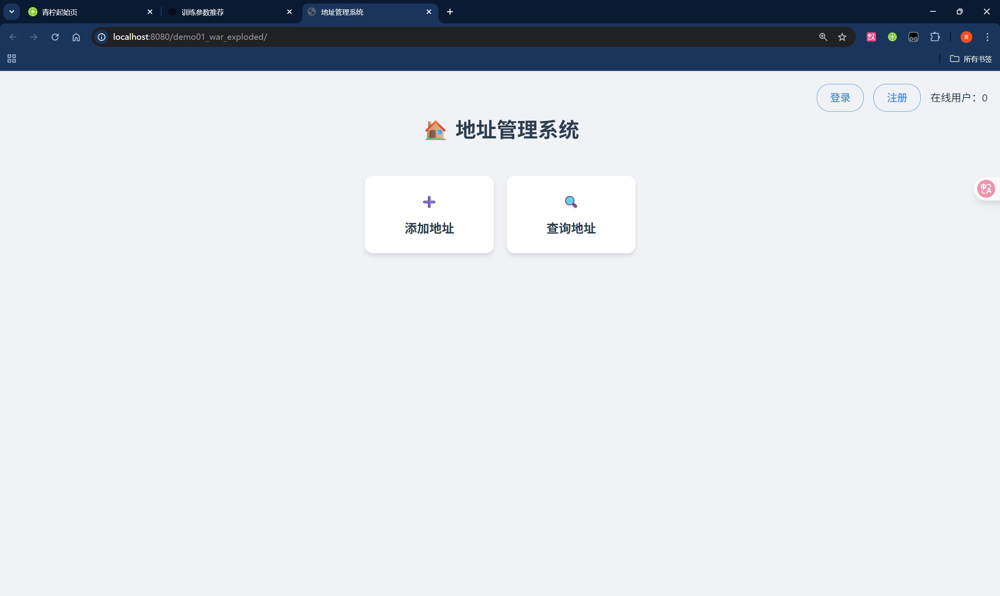
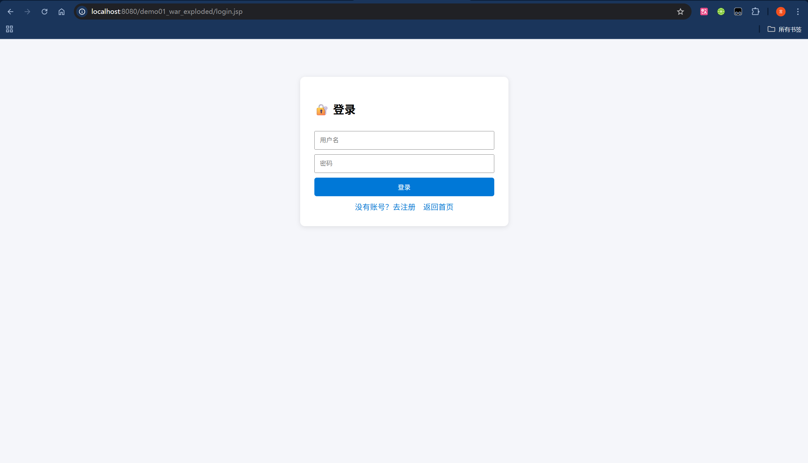
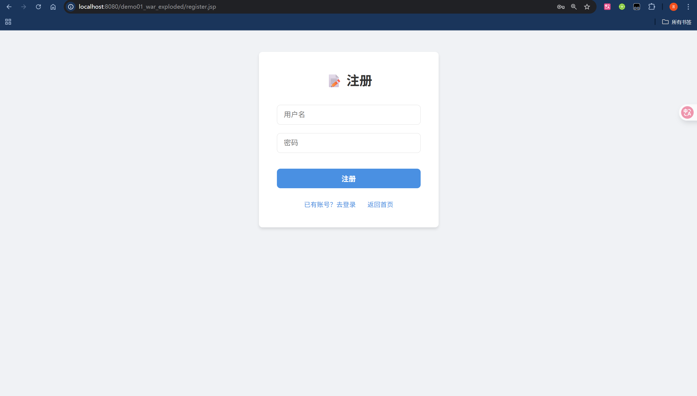
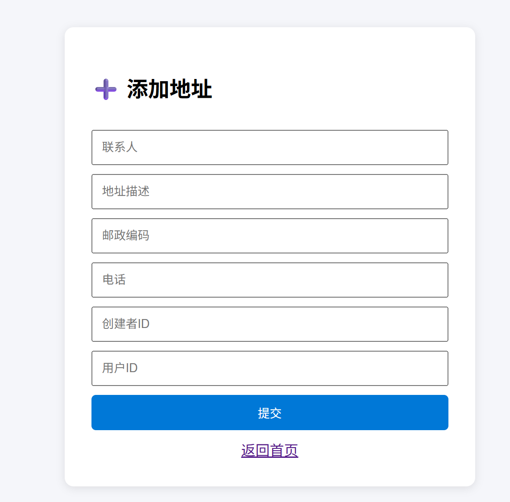
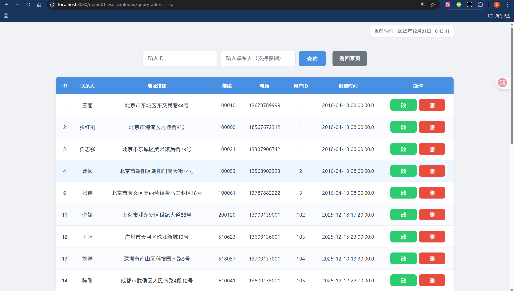
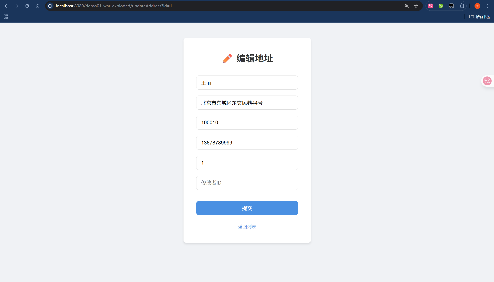

**项目说明** 

- 语雀链接：[JavaWeb](https://www.yuque.com/xiaoluosi-lmxov/ksxj/nagdogia7az53zn5)
- 概览：本项目采用 JSP 前端 + Servlet 后端，所有业务请求统一走 AJAX，后端统一返回 JSON。未登录时，API 返回 JSON（含 `redirect` 登录页）；页面类资源（JSP）仍重定向到登录页。
- 页面入口：`web/index.jsp`；其“查询地址”链接指向 `web/query_address.jsp`，该页用脚本发起查询、分页与删除请求。
- 统一响应格式：`{"success":true|false,"message":"...","redirect":"..."}`

**项目结构**

- 表现层[（JSP）](https://www.yuque.com/xiaoluosi-lmxov/ksxj/th9whlxavg6gqbwx)
  - `web/css/style.css` 全局样式文件，采用现代化设计（卡片式布局、响应式表格、斑马纹列表等）
  - `web/index.jsp` 首页，显示在线人数、登录/注册/退出；退出使用 jQuery AJAX 并按 JSON 的 `redirect` 跳转
  - `web/login.jsp` 登录表单，支持“记住密码”（LocalStorage），使用 jQuery 的 `$.ajax('login', POST)` 并解析 JSON
  - `web/register.jsp` 注册表单，使用 jQuery 的 `$.ajax('register', POST)` 并解析 JSON
  - `web/add_address.jsp` 新增地址，使用 jQuery 的 `$.ajax('addAddress', POST)` 并解析 JSON
  - `web/query_address.jsp` 查询地址，所有查询、分页与删除操作均为 jQuery AJAX；首次加载自动发起查询
  - `web/edit_address.jsp` 编辑地址，GET 加载并回填；POST 提交更新为 jQuery AJAX
- 控制层[（Servlet）](https://www.yuque.com/xiaoluosi-lmxov/ksxj/ou2g4nqingvnt0hb)
  - 登录：`src/servlet/LoginServlet.java`（`/login`）
  - 注册：`src/servlet/RegisterServlet.java`（`/register`）
  - 注销：`src/servlet/LogoutServlet.java`（`/logout`）
  - 新增地址：`src/servlet/AddAddressServlet.java`（`/addAddress`）
  - 查询地址：`src/servlet/QueryAddressServlet.java`（`/queryAddress`）
  - 编辑地址：`src/servlet/UpdateAddressServlet.java`（`/updateAddress`）
  - 删除地址：`src/servlet/DeleteAddressServlet.java`（`/deleteAddress`）
- 过滤器[(Filter)](https://www.yuque.com/xiaoluosi-lmxov/ksxj/kv6uddu7me3i1i7y)
  - `src/filter/AuthFilter.java` 登录拦截；页面资源未登录时重定向到登录页，API 请求未登录时返回 JSON
- 监听器[(Listener)](https://www.yuque.com/xiaoluosi-lmxov/ksxj/xikw4zblukgboelb)
  - `src/listener/OnlineUserCounter.java` 简化为 `int` 计数，监听会话属性增删与会话销毁
- 业务层（Service）
  - `src/service/AddressService.java`、`src/service/impl/AddressServiceImpl.java`
- 数据访问层（DAO）
  - 接口与实现：`src/dao/AddressDao.java`、`src/dao/impl/AddressDaoImpl.java`
  - 公共封装：`src/dao/BaseDao.java`、`src/dao/DBUtil.java`
- 配置
  - `web/WEB-INF/web.xml` 设置欢迎页为 `index.jsp`
  - 依赖 Jar 位于 `web/WEB-INF/lib/`

**接口约定**

- 所有业务接口（登录、注册、注销、地址增删改查）统一返回 JSON：
  - `success`：布尔值，表示请求是否成功
  - `message`：字符串，提示信息
  - `redirect`：字符串，非空时前端应导航到该地址
- 未登录行为：
  - 页面资源（JSP）：重定向到登录页
  - API 请求：返回 `{ success:false, message:"未登录", redirect:"/login.jsp" }`

**前端约定[（jQuery）](https://www.yuque.com/xiaoluosi-lmxov/ksxj/thg1ldvygz431sgm)**

- 统一使用 jQuery 发送请求：
  - `$.ajax({ url, type: 'POST'|'GET', data, dataType: 'json', headers: { 'X-Requested-With': 'XMLHttpRequest' } })`
  - 表单值读取：`$.trim($(form).find('[name="field"]').val())`
  - 响应处理：根据 `success/redirect/message` 做提示与跳转
  - 查询使用 `type: 'GET'` 携带分页与条件；新增/编辑/删除使用 `type: 'POST'`
  - jQuery 引入采用 CDN：`https://code.jquery.com/jquery-3.7.1.min.js`（如有外网限制，建议改为本地文件并统一引用）
- 样式与交互：
  - 引入 `web/css/style.css` 统一全站视觉风格
  - 登录页通过 `localStorage` 存储/读取用户名和密码，实现“记住密码”功能
- 查询页（`query_address.jsp`）：
  - 表单 `submit` 被拦截并触发 `load()`，通过 jQuery AJAX 加载分页数据并渲染表格
  - 分页（首页/上一页/下一页/尾页/跳页/每页大小）均触发 jQuery AJAX 查询
  - 删除按钮按 `id` 发起 `POST /deleteAddress`，成功后刷新列表（使用事件委托保障动态行可用）
  - 收到未登录的 JSON 时自动跳转登录页

**后端约定**

- 所有 Servlet 输出均为 JSON（页面渲染除外）：
  - 登录与注册：成功时在 Session 放入 `currentUser` 并返回 `redirect` 到首页
  - 注销：删除 `currentUser` 并返回 `redirect` 到首页
  - 地址新增/修改/删除：返回操作结果与消息，必要时返回 `redirect`
  - 地址查询：返回分页信息与列表数组
- 统一的 JSON 写出逻辑在各 Servlet 内部的 `writeJson(...)` 方法中使用（避免转义问题）

**关键流程与代码参考**

- 登录：`src/servlet/LoginServlet.java:16-29` 写出 JSON；`src/servlet/LoginServlet.java:41-63` 处理登录与会话
- 注册：`src/servlet/RegisterServlet.java:16-28` 写出 JSON；`src/servlet/RegisterServlet.java:38-65` 处理注册与会话
- 注销：`src/servlet/LogoutServlet.java:12-23` 写出 JSON；`src/servlet/LogoutServlet.java:27-37` 处理注销并返回重定向 JSON
- 查询地址：`src/servlet/QueryAddressServlet.java:22-95` 解析条件与分页、返回列表 JSON
- 新增地址：`src/servlet/AddAddressServlet.java:31-60` 解析参数、返回结果 JSON
- 修改地址：`src/servlet/UpdateAddressServlet.java:31-49` 加载编辑页；`src/servlet/UpdateAddressServlet.java:52-77` 处理更新并返回 JSON
- 删除地址：`src/servlet/DeleteAddressServlet.java:20-35` 根据 `id` 删除并返回 JSON
- 鉴权拦截：`src/filter/AuthFilter.java:39-47` 未登录时区分页面与 API 的处理
- 在线人数：`src/listener/OnlineUserCounter.java:12-58` 基于 `currentUser` 属性增删与会话销毁进行计数

**页面导航与状态**

- 首页“查询地址”链接指向 `query_address.jsp`（页面），由页面脚本去请求数据接口
- 编辑页“返回列表”链接指向 `query_address.jsp` 并带回查询条件与分页参数
- 修复点：
  - 避免字段重名：编辑页用于回传查询条件的隐藏域改为 `contactFilter`，避免与联系人输入框同名导致更新联系人的值被覆盖
  - 查询页读取表单值通过选择器获取输入项，避免与表单属性名冲突（如 `.id`）

**运行说明**

- 将项目部署到 Servlet 容器（如 Tomcat），确保 `web/WEB-INF/lib/` 中的依赖（`javax.servlet-api`、`mysql-connector`）可用
- 数据源配置位于 `src/dao/DBUtil.java` 与 `db.properties`（如存在）
- 欢迎页为 `index.jsp`

**约束与注意**

- 后端不再判断“是否为 AJAX”，所有业务接口统一输出 JSON；前端负责解析并根据 `redirect` 跳转
- 页面类资源（`.jsp`）仍以服务端渲染为主，仅在页面内部通过脚本发起 AJAX
- 未登录时的统一处理：API 返回 JSON；页面跳转到登录页

---

**界面预览**

- 首页
  
- 登录
  
- 注册
  
- 新增地址
  
- 查询/删除地址
  
- 修改地址
  
